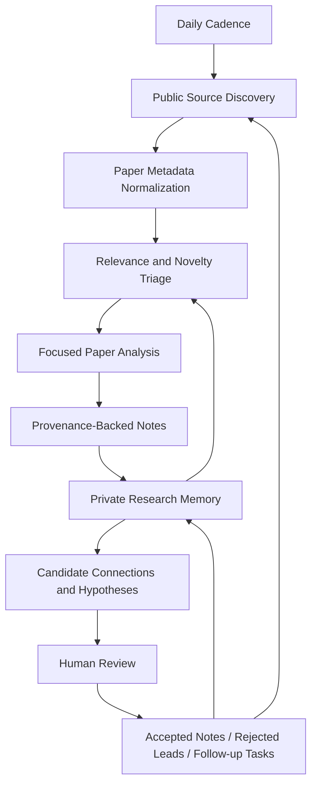

# Quantum Research Agent

Public demo and documentation for a private autonomous quantum foundations research assistant.

This repository is a public evidence and demo layer for a private autonomous research agent focused on quantum foundations and related mathematical physics. The production system is designed to run on a schedule, ingest public research sources, produce provenance-backed research notes, update private research memory, and generate candidate connections or hypotheses for human review.

The full working repository remains private because it contains unpublished research ideas, private notes, prompts, scoring heuristics, operational configuration, and implementation details. This public repository shows the system's conceptual workflow, artifact format, evidence discipline, and a reproducible demo mode without exposing private research IP.

## What This Repo Is

This repo contains:

- A public conceptual workflow description of the autonomous research pipeline.
- A public showcase of sanitized operating evidence and research-assistant behavior.
- Sample daily run artifacts that demonstrate the expected output shape.
- JSON schemas for run manifests, provenance records, paper records, and analysis reports.
- A deterministic demo pipeline that produces a mock daily research report from public/sample inputs.
- Validation scripts for checking artifact structure and scanning for obvious secrets.
- Public documentation explaining scope, limitations, evidence labels, and responsible claim language.

## What This Repo Is Not

This repo is not the full production agent. It does not contain private research memory, unpublished proof attempts, full prompts, raw model traces, scheduler credentials, API keys, private notes, or internal scoring heuristics.

It is also not a claim that the agent independently proves new physics. The system is best described as an autonomous research assistant that helps discover, triage, summarize, connect, and organize research leads for human review.

## Why The Full Repo Is Private

The production repository contains unpublished research directions and working notes. Publishing it prematurely would expose private intellectual work and may create confusion between rough exploratory outputs and reviewed research claims.

This public repo separates evidence of workflow shape, artifact discipline, and demo behavior from the private research corpus and implementation.

## Conceptual Workflow

At a high level, the private system follows a daily research loop:



The diagram is intentionally conceptual. It shows the research feedback loop without exposing private prompts, scoring heuristics, deployment details, code architecture, or the private research memory.

More detail is available in [docs/architecture.md](docs/architecture.md).

## Evidence Artifacts

Artifacts in this repository use explicit labels:

- `sample`: hand-created or generated examples showing expected shape. Not production runs.
- `demo`: output generated by the public demo pipeline. Not production runs.
- `sanitized_real_run`: output derived from a real production run after manual sanitization.
- `template`: blank or partial structures meant to guide future artifacts.

The initial version of this repository includes only `sample` and locally generated `demo` artifacts. It does not include sanitized production runs.

See [examples/README.md](examples/README.md) and [docs/evidence_policy.md](docs/evidence_policy.md).

## Showcase Evidence

The [showcase](showcase/README.md) directory adds sanitized evidence for what the private system does over time:

- [operations_summary.md](showcase/operations_summary.md): sanitized aggregate run history and reliability snapshot.
- [memory_compounding_example.md](showcase/memory_compounding_example.md): how repeated runs build on prior research memory.
- [hypothesis_case_study.md](showcase/hypothesis_case_study.md): how source material becomes a candidate hypothesis for review.
- [sanitized_runs/2026-06-10](showcase/sanitized_runs/2026-06-10): one sanitized real-run summary with private details removed.

These artifacts are evidence summaries. They do not include raw logs, private prompts, paper IDs, private notes, unpublished proof attempts, scoring heuristics, or production code.

## Demo Mode

Demo mode is intentionally simple and deterministic. It reads sample paper records, applies transparent toy scoring rules, and writes a demo run folder containing:

- `run_manifest.json`
- `daily_report.md`
- `paper_triage.md`
- `idea_candidates.md`
- `provenance.json`
- `validation_report.json`

The demo does not call external APIs, does not require production credentials, does not update private memory, and does not include the private ranking or reasoning system.

## Example Output

A daily report in this public repo looks like this:

```md
# Daily Research Report

Run ID: `generated-demo`
Artifact status: `demo`
Pipeline mode: `public_demo`
Human review status: `not_reviewed`

## Summary

This demo report shows the shape of a daily autonomous research-agent artifact.
It is not a production run.
```

See [examples/runs/2026-06-01-sample/daily_report.md](examples/runs/2026-06-01-sample/daily_report.md) for a static sample.

## Validation And Provenance

The public repo includes validation checks for required files, JSON schema structure, artifact labels, and obvious secret patterns. These checks are guardrails, not a substitute for manual review before publication.

```bash
python scripts/validate_public_repo.py
```

## Limitations

This project should be understood as an autonomous research-assistance pipeline. It can discover, triage, summarize, organize, and propose candidate connections, but it does not replace mathematical proof, peer review, or expert judgment.

Candidate hypotheses are speculative until reviewed. Sample and demo artifacts are not production logs.

## Responsible Claim Language

Good public wording:

> I built a private autonomous quantum foundations research assistant that runs a structured research loop, records provenance, maintains private research memory, and proposes candidate connections for human review. This public repo documents the workflow shape and provides a safe demo without exposing private research IP.

Avoid saying that the system independently proves new physics or that this repository is the full production agent.

## Run The Demo

```bash
python -m venv .venv
source .venv/bin/activate
pip install -e ".[dev]"
python scripts/generate_demo_run.py
python scripts/validate_public_repo.py
pytest
```

The demo reads [examples/sample_public_papers.json](examples/sample_public_papers.json) and writes a generated run under `examples/runs/generated-demo/`.

## Repository Status

This repository is a public documentation and demo layer. The private production agent, private research memory, operational configuration, prompts, and unpublished research materials are intentionally excluded.

## Contact

For collaboration, review, or reuse requests, contact the repository owner.
