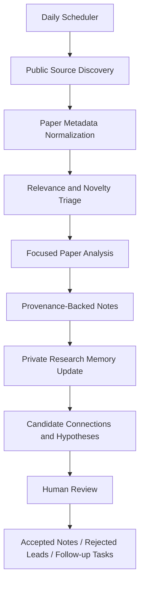

# Architecture

This document describes the private research agent at a safe, public level. It is meant to communicate behavior and artifact boundaries without exposing private implementation details, prompts, scoring heuristics, deployment configuration, or research memory.

## Stages

| Stage | Public description |
| --- | --- |
| Scheduler | Runs the research loop on a regular cadence. |
| Source discovery | Finds public research items such as papers, feeds, and metadata. |
| Metadata normalization | Cleans source records into consistent paper records. |
| Triage | Ranks items by relevance and novelty for the research agenda. |
| Focused analysis | Extracts structured notes from selected items. |
| Provenance-backed notes | Links claims and observations back to source records. |
| Private memory update | Updates unpublished research memory. This layer is not published here. |
| Candidate connections and hypotheses | Proposes research leads for review. These are not final claims. |
| Human review | Final interpretation, acceptance, rejection, and follow-up remain human-led. |

The public demo implements only a small deterministic simulation of the artifact flow. It does not include the private production pipeline, private prompts, private memory, scheduler configuration, or internal research strategy.
